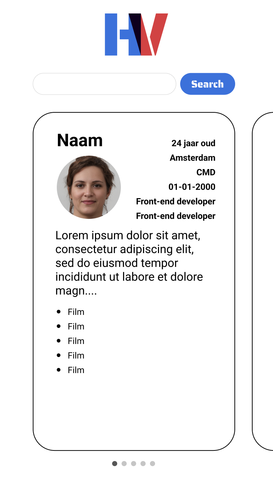

# README Heroes & Villains
## Leden
- Tristan Brattinga
- Bart Spons
- Martijn Kooijman
- Ferhat Kool
- Klaudia Dobrzelewska

## Thema
Ons team heeft het thema films gekozen voor de teamapp. Elk teamlid heeft vijf films moeten kiezen die zij beschouwen als hun favorieten. Bovendien hebben we lijsten samengesteld van onze favoriete helden en schurken, waarmee we dieper ingaan op het filmthema. De nummer één held van elk teamlid wordt gebruikt als hun avatar. Al deze informatie, inclusief de linkjes naar onze persoonlijke apps, is zichtbaar en gesorteerd per teamlid binnen onze app.

## Idee
Zoals hierboven genoemd is ons algemene thema films. Om deze informatie overzichtelijk te presenteren aan de gebruikers, hebben wij besloten om verschillende functionaliteiten erin te verwerken. Denk hierbij aan filtreren, sorteren en zoeken. Op deze manier kunnen gebruikers snel de gewenste informatie vinden. De zichtbare informatie komt uit de JSON-data van de teamleden. Deze wordt vervolgens opgehaald en getoond binnen de app. Op deze manier kunnen gebruikers onze teamleden beter leren kennen aan de hand van onze gedeelde interesse.

## Taakverdeling
- Tristan
    - Hoofd van de code
- Bart 
    - Hulp bij code 
    - Process
    - Schetsen
    - Digitale schets
- Klaudia
    - Readme
- Ferhat
    - host
- Martijn
    - responsive

# Process
## Schetsen

Ons eerste idee was om een simpele card slider te maken. Als je dan klikte op een card kreeg
je de volledige informatie van de teammember te zien. Hieronder een Figma schets van ons eerste idee:



Hieronder zijn onze getekende schetsen te zien toen we ons uiteindelijke idee hadden. Het idee is dat er op de pagina 5 buttons staan met allemaal een eigen avatar. Deze buttons draaien allemaal in een rondje. Het idee is dat deze om een planeet heendraaien.

De avatar van de button wordt uit het JSON bestand ingeladen. Iedereen heeft een eigen avatar. Als de gebruiker op een van deze buttons klikt wordt er een pop-up scherm geopend met allemaal info over een van onze teamleden.

<br>

## Digitale schetsen

<br>

<br>

## Mappenstructuur
```
web-app-from-scratch-team
|--- images
|--- node_modules
|--- public
    |--- css
        |--- style.css
    |--- images
    |--- scripts
        |-- script.js
|--- views
    |--- pages
        |--- index.ejs
    |--- partials
        |--- avatar.ejs
        |--- footer.ejs
        |--- head.ejs
        |--- header.ejs
        |--- searchbar.ejs
package-lock.json
package.json
README.md
server.js
team.json
yarn.lock

```
## Code
### index.ejs is de hoofdpagina
De pagina index.ejs wordt gebruikt als hoofdpagina. In plaats van een index.html pagina wordt gebruik gemaakt van ejs. Omdat alle data te veel is om in één bestand te zetten wordt er gebruik gemaakt van partials. Dit zijn aparte componenten die worden ingeladen om één pagina. Voor een aantal onderdelen zijn standaard partials aangemaakt:
- head
- header
- footer

In de main staan er meer dan één. Hiervoor is meer te lezen in het volgende kopje.

```html
<!DOCTYPE html>
<html lang="en">
<head>
    <title>Team WAFS</title>
    <%- include('../partials/head'); %>
</head>
<body>
<div class="space"></div>
<header>
    <%- include('../partials/header'); %>
</header>

<main>
    <%- include('../partials/searchbar'); %>
        <%- include('../partials/cards'); %>
    <%- include('../partials/avatars'); %>
    <button id="goCrazy">GO CRAZY</button>
</main>

<footer>
    <%- include('../partials/footer'); %>
</footer>
<script src='/scripts/script.js'></script>
</body>
</html>
```
<hr>

### Partials inladen
#### Avatars.ejs
In avatars.ejs wordt alle data van onze teamleden ingeladen en weergegeven. Natuurlijk hoeven we niet alle data te laten zien maar bepaalde keys.

Wat we gebruiken op onze team website:
- naam
- leeftijd
- werk
- stad
- studie
- favoriete films
- foto avatar
- top 5 helden
- top 5 schruken

```html
<section class="planet container">
    <ul class="circle-wrapper">
        <% members.map((member, index) => { %>
            <li class="circle">
                <dialog class="dialog">
                    <form method="dialog">
                        <h2>Hero passport</h2>
                        
                        <h3><%= member.name %></h3>
                        <ul>
                            <li><%= member.age %></li>
                            <li><%= member.job %></li>
                            <li><%= member.city %></li>
                            <li><%= member.study %></li>
                        </ul>
                        <p><%= member.bio %></p>
                        <ul>
                            <% member.favouriteMovies.map((movie) => { %>
                                <li><%= movie %></li>
                            <% }) %>
                        </ul>
                        <button class="closeCardButton">
                            <span></span>
                            <span></span>
                        </button>
                    </form>
                </dialog>
                <button class="avatarButton">
                    " alt="" />
                </button>
            </li>
        <% }) %>
    </ul>

</section>
```

<hr>

#### Team.json 
Hier staat link in naar iedereen zijn/haar persoonlijke json met data

```JSON
{
  "teamName": "Heroes & Villains",
  "members": [
    {
      "name" : "Tristan Brattinga",
      "personalPage" : "https://pad/naar/de/app/van/teamlid-1"
    },
    {
      "name" : "Bart Spons",
      "personalPage" : "https://bart-spons.github.io/web-app-from-scratch-2324/"
    },
    {
      "name" : "Ferhat Kool",
      "personalPage" : "https://ferhatkool.github.io/web-app-from-scratch-2324/"
    },
    {
      "name" : "Klaudia Dobrzelewska",
      "personalPage" : "https://sonozakis.github.io/web-app-from-scratch-2324/"
    },
    {
      "name" : "Martijn Kooijman",
      "personalPage" : "https://martino538.github.io/web-app-from-scratch-2324/"
    }
  ]
}
```

<hr>

#### Server.js 
Dit bestand wordt gebruikt om data van het team te fetchen. Eerst een aantal standaard dingen die gebeuren.
- dotenv inladen
- express gebruiken
- localhost:3000 om de website op de liveserver te testen

```javascript
require('dotenv').config()
const express = require('express')
const app     = express()
const port    = process.env.PORT || 3000

app.use(express.static('public'))

// set the view engine to ejs
app.set('view engine', 'ejs')

const teamMembers = [
  "https://bart-spons.github.io/web-app-from-scratch-2324/json/bart.json",
  "https://raw.githubusercontent.com/ferhatkool/web-app-from-scratch-2324/master/docs/json/data.json",
  "https://tristanbrattinga.github.io/wafs/data.json",
  "https://martino538.github.io/web-app-from-scratch-2324/assets/dataset/dataset-Martijn.json",
  "https://sonozakis.github.io/web-app-from-scratch-2324/scripts/info.json"
]

let memberData = []

const fetchTeamData = () => {
  {teamMembers.map(member => {
    fetch(member).then((res) => {
        if (!res.ok) {
          throw new Error
          (`HTTP error! Status: ${res.status}`)
        }
        return res.json()
      })
      .then((data) => {
        memberData.push(data)
        console.log(memberData)
        return memberData
      })
      .catch((e) => console.error('Unable to fetch team data:', e))
  })}
}

fetchTeamData()

// index page
app.get('/', (req, res) => {
    res.render('pages/index', { members: memberData })
})

// Error handling for not-existing pages
app.use((req, res) => {
  res.status(404).send('We`re sorry, we were not able to find the page you were looking for')
})

// Start the server
app.listen(port, () => {
  console.log(`Server is listening to port: ${port}`)
})
```

<hr>

## Host
### Domein
De website wordt gehost op de server van één van de studenten. Om de website een duidelijke naam te geven is een domeinnaam verkregen genaamd heroesandvillains.nl.
 
### Routing
Het verkeer dat naar de website toe gaat wordt via meerdere hosts omgeleid, beginnende bij het publiekelijke IP van de student die de webserver host. Het verkeer gaat vervolgens naar een virtuele pfSense router dat beschikt over een ingeregelde firewall. Deze router stuurt het verkeer weer door naar de Nginx Proxy Manager, vanwaar er op basis van het domeinnaam wordt gekeken waar het verkeer heen moet. heroesandvillains.nl staat gekoppeld aan een IP-adres, dus wanneer er verkeer langs komt met als doel heroesandvillains.nl, zal de Nginx Proxy Manager het verkeer omleiden naar het gekoppelde IP. Nu het verkeer is beland op de host waar de webserver op wordt uitgevoerd zal de Apache2 Proxy het HTTPS-verkeer omzetten naar HTTP-verkeer, zodat de nodeJS-server hier wat mee kan gaan doen. Het verkeer omzetten van HTTPS naar HTTP wordt normaal gesproken afgeraden, omdat dit het normaliter mogelijk maakt dat een aanvaller vanaf het netwerk mee kan luisteren naar het verkeer. Echter, de route dat het verkeer netwerk-techinisch gezien aflegd is volledig versleuteld, dus is het in deze situatie voor een aanvaller niet mogelijk om mee te luisteren.
 
### Back-end
De back-end bestaat uit een proxy dat het inkomende verkeer doorgeleid naar een lokaal uitgevoerde nodeJS 'server'. Normaal zou dit niet nodig zijn en kan het inkomende verkeer direct naar de nodeJS 'server', echter is ervoor gekozen om HTTPS te gebruiken i.p.v. HTTP en om de code niet verder aan te passen is het noodzakelijk dat het inkomende HTTPS verkeer via de Apache2 proxy wordt omgeleid naar de nodeJS 'server'. De apache2 proxy bevat de volgende configuratie:
```
NameVirtualHost *:443
<VirtualHost *:443>
  ServerName heroesandvillains.nl
  DocumentRoot /var/www/web-app-from-scratch-2324-team
 
  CustomLog <LOG-PATH> combined
  ErrorLog <ERROR-LOG-PATH>
 
  # Example SSL configuration
  SSLEngine on
  SSLProtocol all -SSLv2
  SSLCipherSuite HIGH:MEDIUM:!aNULL:!MD5
  SSLCertificateFile "/var/www/web-app-from-scratch-2324-team/ssl/cert1.pem"
  SSLCertificateKeyFile "/var/www/web-app-from-scratch-2324-team/ssl/privkey1.pem"
  SSLCACertificateFile "/var/www/web-app-from-scratch-2324-team/ssl/chain1.pem"
 
  ProxyPass / http://0.0.0.0:3000/
  ProxyPassReverse / http://0.0.0.0:3000/
</VirtualHost>
```
 
Om de nodeJS 'server' uit te voeren is een lokale service aangemaakt die een commando uitvoert om de 'server' op te starten op poort 3000. Het verkeer komt binnen via poort 443 en wordt omgeleid naar poort 3000.
```
[Unit]
Description=Service to run a nodejs server
After=network.target
 
[Service]
Type=simple
ExecStart=node /var/www/web-app-from-scratch-2324-team/server.js
Restart=on-failure
user=web-runner
group=web-runner
WorkingDirectory=/var/www/web-app-from-scratch-2324-team
 
[Install]
WantedBy=multi-user.target
```

## Responsive 
De website moet natuurlijk ook responsive zijn. Dit is opgelost door middel van een mediaquery. Hiernaast is er een extra animatie toegevoegd d.m.v. keyframes. Deze zal zichtbaar zijn zodra de 'circle-wrapper' class de extra class 'crazy' heeft. Kort samengevat zorgt deze animatie ervoor dat de cirkels van buiten naar binnen (en terug) animeren. De code is hieronder te zien:

<strong>Media query voor apparaten voor telefoon:</strong>


<strong>Voor overige apparaten:</strong>


## Bronnenlijst
<ul>
    <li>https://stackoverflow.com/questions/71839052/html-dialog-tag-modal-scrolling-to-bottom-on-open</li>
    <li>https://stackoverflow.com/questions/25864259/how-to-close-the-new-html-dialog-tag-by-clicking-on-its-backdrop</li>
    <li>https://css.glass/</li>
    <li></li>
    <li></li>
    <li></li>
    <li></li>
    <li></li>
    <li></li>
</ul>

